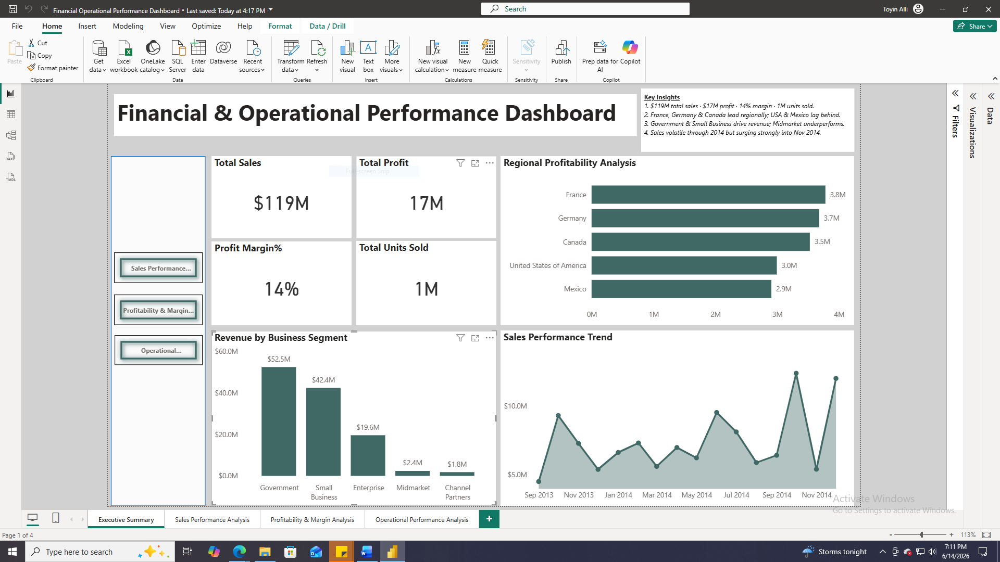
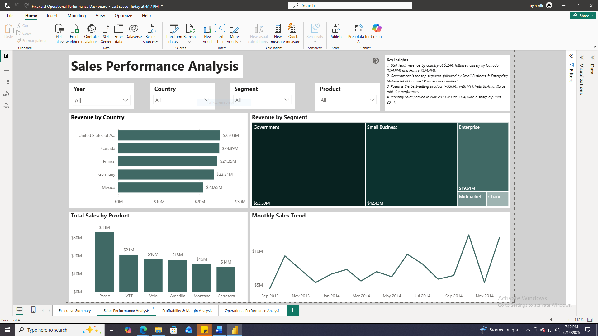

#  Financial & Operational Performance Dashboard

## Executive Summary

This project demonstrates the development of an end-to-end Business Intelligence solution using Power BI to transform transactional financial data into actionable business insights. The interactive dashboard enables decision-makers to monitor sales performance, profitability, operational efficiency, and key business metrics across multiple countries, customer segments, and products.

---

## Business Problem

Organizations operating across multiple markets often rely on fragmented reports and spreadsheets, making it difficult to answer critical business questions such as:

- Which products generate the highest profitability?
- Which customer segments drive the most revenue?
- How do discounts affect profit margins?
- What sales trends and seasonal patterns influence performance?
- Where should leadership focus future investments?

Without centralized reporting, decision-making becomes slower and opportunities for growth are easily overlooked.

---

## Solution Overview

To address these challenges, I developed a four-page interactive Power BI dashboard that consolidates financial and operational metrics into a single reporting solution.

The dashboard enables users to:

- Monitor organizational KPIs
- Analyze sales performance
- Evaluate profitability
- Identify operational trends
- Support data-driven business decisions

---

## Dashboard Preview

### Executive Summary

### Sales Performance

### Profitability & Margin

### Operational Performance

---

## Data Source

**Dataset**

Financial Sample Dataset

**Time Period**

September 2013 – December 2014

**Records**

Approximately 700 financial transactions

---

## Technology Stack

- Power BI
- Power Query
- DAX
- Excel

---

## Key Insights

- Government generated the highest revenue, contributing approximately 44% of total sales.
- Paseo was the strongest-performing product in both revenue and units sold.
- VTT demonstrated the highest profit efficiency relative to sales.
- Heavy discounting reduced profitability for several products.
- Sales exhibited clear seasonal trends, creating opportunities for improved planning.

---

## Business Recommendations

- Prioritize Government accounts and contract expansion.
- Review discount strategies to improve margins.
- Increase investment in high-performing products such as Paseo and VTT.
- Investigate low-margin products to improve profitability.
- Use seasonal trends to optimize inventory and resource planning.

---

## Business Impact

This dashboard enables decision-makers to:

- Monitor financial performance
- Improve pricing strategies
- Track profitability
- Optimize operational efficiency
- Support strategic decision-making

---

## Technical Skills Demonstrated

### Business Intelligence

- Power BI
- DAX
- Power Query

### Data Analytics

- Financial Analysis
- Sales Analytics
- Operational Analytics
- KPI Development

### Dashboard Design

- Executive Reporting
- Interactive Visualizations
- Business Storytelling
- Decision Support

---

